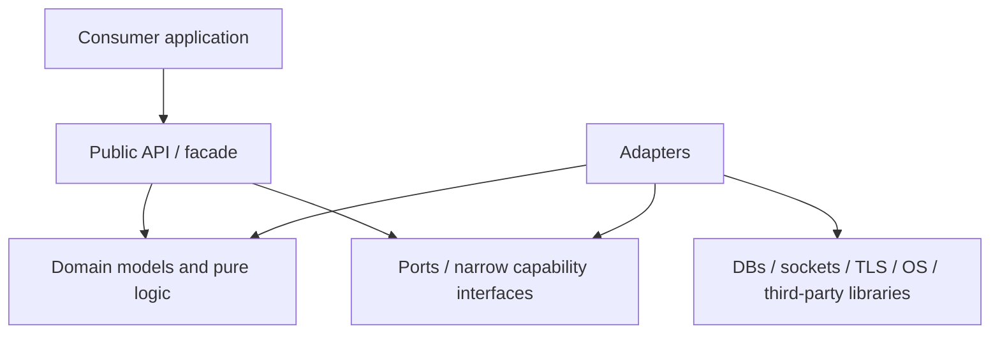

# 0002 — Layered architecture

## Status

Accepted as modernization guidance.

## Mental model

Each libcoda component should be understandable as a small dependency graph rather than a stack of inheritance layers. Dependencies point inward toward stable policy and value semantics; external systems remain at the edge.



The arrows describe source/compile-time dependency direction, not runtime control flow. Adapter selection and wiring happens at the composition/factory edge appropriate to the component or consuming application.

The important rule is not the number of boxes. It is that domain/parser/query logic does not acquire a dependency on concrete infrastructure merely because that infrastructure is convenient to call.

## Layer responsibilities

### Public API / facade

Owns the supported consumer-facing types and entry points.

It should:

- expose stable value-oriented contracts where practical;
- avoid namespace pollution and implementation-only dependencies;
- make ownership and error behavior clear;
- delegate concrete infrastructure work rather than embedding platform/service logic in public headers.

### Domain models and pure logic

Owns deterministic transformations and invariants.

Examples include:

- format grammar/specifier models and rendering rules;
- SQL values, query models, clauses, bind mapping, and SQL generation;
- URI and protocol parsing/encoding;
- state/lifecycle validation that does not require a live external resource.

This layer should have the highest unit-test and fuzz-test density because it can run without external services.

### Ports / capability interfaces

Ports exist where they provide a real seam for substitution, lifecycle isolation, or testing.

Good candidates include:

- DB session/statement/transaction capabilities;
- network transport read/write/close behavior;
- TLS wrapping/verification capability;
- time/filesystem/platform operations only when a component actually needs them.

Ports should be narrow. Avoid a single broad `database` or `network` interface that forces unrelated capabilities together.

### Adapters

Adapters translate a port/domain contract to a concrete dependency.

Examples:

- SQLite, MySQL, and PostgreSQL session/statement/result adapters;
- POSIX/Windows socket adapters;
- OpenSSL secure-layer adapters;
- libcurl HTTP client adapters;
- uriparser/cereal integration.

Adapter-specific types, headers, error codes, and lifecycle quirks should not leak inward unless the public contract deliberately exposes them.

## Component-specific target shape

### Format

Target direction:

```text
format public API
  -> format parser/specifier model
  -> renderer / argument state
```

Parsing should not require rendering side effects. Fuzz targets should be able to exercise parser/state transitions deterministically.

### Database

Target direction:

```text
query/value/model
  -> SQL generation + bind semantics
  -> DB capability contracts
  <- SQLite/MySQL/PostgreSQL adapters
```

Query construction and SQL generation must not depend on a live DB connection. Backend-specific OIDs, handles, headers, and error codes belong in backend adapters.

### Networking

Target direction:

```text
URI/protocol models + parsers
  -> transport capability
  <- socket adapter
  <- TLS adapter/wrapper
  -> sync/async orchestration
  -> HTTP/telnet behavior
```

Protocol parsing should be separable from socket I/O. TLS verification policy should be explicit rather than an incidental socket option.

## Dependency rules

New or materially changed code should satisfy these rules:

1. Public/domain code must not include concrete DB, socket, TLS, or OS implementation headers unless that dependency is explicitly part of the public contract.
2. Pure parsers, encoders, query builders, and value conversions must be runnable without live external services.
3. Adapter targets may depend on third-party/platform APIs; core targets should not gain those dependencies merely to reuse adapter helpers.
4. Optional backends should be represented by optional targets, not by dangling target names or global preprocessor state.
5. Build options and compile definitions should be target-owned where possible.
6. Cross-component dependencies must be explicit in CMake target linkage and public include interfaces.
7. A test seam is not automatically a production abstraction: introduce a port when substitution represents a meaningful capability boundary.

## SOLID applied pragmatically

- **Single Responsibility:** separate parsing, rendering, query modeling, backend adaptation, transport, TLS, and orchestration when they change for different reasons.
- **Open/Closed:** add concrete DB/network adapters through bounded targets/capabilities instead of scattering backend conditionals through core logic.
- **Liskov:** interchangeable adapters must obey the same documented success, error, ownership, and lifecycle contracts.
- **Interface Segregation:** model capabilities such as transaction, statement execution, transport read/write, and TLS wrapping independently when callers need different subsets.
- **Dependency Inversion:** policy/domain code depends on stable capability contracts; infrastructure implements them.

SOLID is a constraint on coupling, not a mandate for deep class hierarchies.

## Review checklist

For a change crossing layers, reviewers should ask:

- Can the core behavior be tested without the external system?
- Did a concrete dependency move inward unnecessarily?
- Is ownership/lifetime still obvious?
- Is this abstraction justified by a capability boundary or only by anticipated reuse?
- Does the CMake target graph match the source dependency graph?
- Could untrusted input reach an adapter before validation/normalization that belongs in a pure layer?
