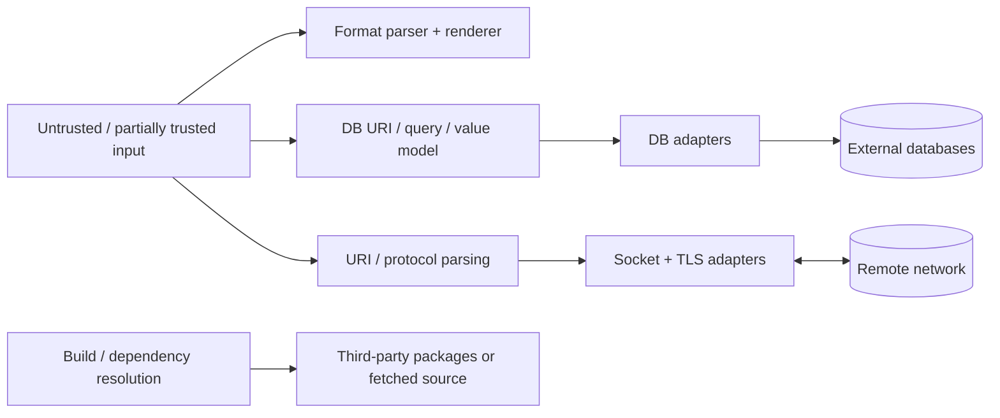

# libcoda security threat model

## Status

Active modernization baseline. Component documents refine this model for format, database, and networking code.

## Scope

This threat model covers the aggregate libcoda toolkit and the security boundaries created when consumers pass data into format parsing, database/query APIs, URI handling, socket/protocol code, TLS, and third-party adapters.

It does not assume all legacy code already satisfies the mitigations below. Findings marked as current debt are inputs to #4, #6, #8, and #9.

## Security goals

1. Untrusted input must not cause memory corruption, undefined behavior, use-after-free, double-free, or process-wide compromise.
2. Malformed input should fail through documented errors, not crashes or raw-pointer exception ownership.
3. Database credentials and authentication material must not be exposed by normal string conversion, diagnostics, or logs.
4. SQL construction must preserve a clear boundary between SQL structure and bound data values.
5. Secure network connections must authenticate the intended peer; encryption without certificate/hostname verification is not sufficient.
6. Resource use from attacker-controlled inputs should be bounded enough to resist trivial memory/CPU exhaustion.
7. Normal builds should be deterministic and should not silently execute unpinned network dependency downloads.

## Assets

- process memory integrity and availability;
- application data sent through libcoda APIs;
- database credentials and connection URIs;
- SQL statement/data integrity;
- TLS trust decisions and network confidentiality/integrity;
- socket/file descriptor and native-library handle ownership;
- build dependency provenance and CI integrity;
- consumer expectations encoded in public APIs and error contracts.

## Threat actors and inputs

Relevant threats can originate from:

- a remote network peer controlling bytes returned to a socket/protocol parser;
- an attacker controlling a hostname, URI, request/response field, or format string;
- partially trusted configuration containing database URIs/credentials;
- application data accidentally passed through unsafe SQL/string construction paths;
- a malicious or compromised external database/network service;
- a compromised or drifting third-party dependency source;
- ordinary callers exercising undocumented lifecycle states that expose unsafe ownership bugs.

The model does not require a malicious caller for every defect. Memory ownership and error-handling defects are security-relevant because benign failures can become exploitable when inputs later become attacker-controlled.

## Trust boundaries

Each arrow crossing into an adapter or parser is a validation/ownership boundary. Data that is safe as a value is not automatically safe as SQL structure, a hostname trust decision, a buffer length, or a log message.

## Primary abuse cases

### Memory and ownership corruption

Risk sources include native handles, raw pointers, copied resource owners, buffer lengths, and lifecycle state.

Mitigations:

- RAII and single-owner semantics for native resources;
- delete copy operations for non-shareable OpenSSL/socket/native-handle owners unless deep-copy semantics are proven;
- sanitizer coverage for resource-owning code;
- fuzz parser/state transitions with bounded inputs;
- validate sizes before narrowing from `size_t` to C APIs using smaller integer types.

### Credential disclosure

Database URIs can contain usernames/passwords. A parsed URI representation must not make the raw credential-bearing string the default log/display representation.

Mitigations:

- separate raw/secret-bearing input from redacted display output;
- redact passwords and authentication query parameters in exceptions/logs;
- test stringification/error paths with credentials present;
- avoid copying credentials into diagnostics unless explicitly requested by a trusted caller.

### SQL injection / query confusion

Mitigations:

- use bind parameters for data values;
- keep SQL structure generation separate from user data values;
- document where raw SQL fragments are intentionally accepted;
- unit/fuzz test query generation and bind mapping without a live service;
- do not claim binding protects identifiers or SQL syntax that is concatenated structurally.

### TLS peer impersonation

A TLS handshake that does not verify certificate trust and the requested hostname is vulnerable to active interception.

Mitigations:

- use a client TLS method appropriate to supported OpenSSL versions;
- enable certificate-chain verification with trusted roots;
- verify the expected hostname/IP against the certificate;
- expose verification failure as a stable error;
- test failure for untrusted/mismatched certificates;
- document any explicitly insecure mode and never make it the default.

### Parser/resource exhaustion

Mitigations:

- bound fuzz harness input and repeated operations;
- avoid unbounded recursion or attacker-driven allocation where practical;
- validate indexes, widths, lengths, counts, and integer conversions;
- treat malformed input as expected parse failure rather than retry loops or partial unsafe state.

### Build/dependency compromise

Mitigations:

- prefer installed/imported dependency targets;
- disable build-time network fetching by default;
- pin any explicit fallback download;
- use read-only CI permissions and non-persisted checkout credentials;
- pin runner environments where dependency package contracts are version-specific;
- add SBOM/provenance work when packaging/release automation matures.

## Current high-priority findings

The current modernization review identified these concrete risks:

1. **Network TLS verification:** the OpenSSL layer creates a client context and performs `SSL_connect`, but current code does not establish visible certificate-chain or hostname verification policy.
2. **OpenSSL ownership:** `openssl_layer` exposes copy construction/assignment while owning `SSL*` and `SSL_CTX*`; shallow copying native owners can lead to double-free/use-after-free.
3. **Raw-pointer exception:** socket extraction still contains `throw new socket_exception(...)`.
4. **Static/shared address buffers:** socket IP rendering uses APIs/static storage that are not safe as a value-oriented/thread-safe public result.
5. **DB credential representation:** `uri_type` stores the original URI and its string conversion returns it, including any parsed password.

These are remediation inputs, not accepted behavior.

## Security verification strategy

Security assurance should be layered:

- unit tests for validation/error/redaction contracts;
- deterministic integration tests with SQLite/fake transports;
- ASAN/UBSAN for memory/undefined behavior;
- TSAN where shared network state becomes meaningful;
- AFL++/other fuzzing for parsers, bind/query generation, protocol boundaries, and state transitions;
- static analysis (`clang-tidy`, CodeQL and/or equivalent) for ownership/API misuse;
- explicit service-integration jobs for MySQL/PostgreSQL/live networking rather than coupling them to unit tests.

## Release hardening checklist

Before treating a release as hardened:

- [ ] normal CI build/test path is green on supported toolchains;
- [ ] sanitizer jobs are green for applicable components;
- [ ] static analysis has no untriaged high-confidence security findings;
- [ ] fuzz smoke targets build and execute checked-in corpora;
- [ ] no normal build requires implicit third-party network fetching;
- [ ] credentials are redacted from routine errors/logs;
- [ ] TLS verification defaults are documented and secure;
- [ ] resource-owning types have reviewed copy/move/destruction semantics;
- [ ] optional DB/network backends are isolated behind explicit targets/options;
- [ ] known security exceptions/deviations are documented with bounded follow-up issues.

## Related architecture

This model is constrained by:

- [`../architecture/0002-layered-architecture.md`](../architecture/0002-layered-architecture.md)
- [`../architecture/0003-error-handling.md`](../architecture/0003-error-handling.md)
- [`../architecture/0004-dependency-policy.md`](../architecture/0004-dependency-policy.md)
